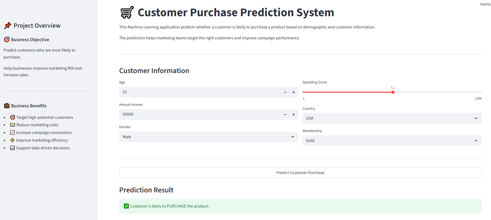

# Customer Purchase Prediction

### AI-Powered Customer Purchase Prediction using Machine Learning

---

# 📌 Table of Contents

- [Project Overview](#project-overview)
- [Business Objectives](#business-objectives)
- [Dataset](#dataset)
- [Machine Learning Pipeline](#machine-learning-pipeline)
- [Models Used](#models-used)
- [Hyperparameter Tuning](#hyperparameter-tuning)
- [Evaluation Metrics](#evaluation-metrics)
- [Streamlit Application](#streamlit-application)
- [Project Structure](#project-structure)
- [How to Run This Project](#how-to-run-this-project)
- [Author & Contact](#author--contact)

---

# 📌 Project Overview

This project predicts whether a customer is likely to purchase a product based on demographic and customer-related information.

The objective is to help businesses identify high-potential customers before launching marketing campaigns, enabling smarter targeting, improving conversion rates, and increasing marketing ROI.

<p align="center">
  
</p>

---

# 🎯 Business Objectives

- Predict customers who are most likely to purchase a product.
- Help businesses improve marketing ROI and increase sales.
- Reduce unnecessary marketing costs.
- Support data-driven marketing decisions.

---

# 📂 Dataset

The project uses two datasets.

| File | Description |
|------|-------------|
| `customer_data.csv` | Historical customer data used to train the machine learning model. |
| `new_customers.csv` | New customer records used to generate predictions. |

### Features

- Age
- Annual Income
- Spending Score
- Gender
- Country
- Membership

### Target Variable

- Purchase (Yes / No)

---

# ⚙️ Machine Learning Pipeline

The project follows a complete end-to-end machine learning workflow.

### Data Preprocessing

- Missing Value Imputation
- Feature Scaling
- One-Hot Encoding
- Column Transformer
- Scikit-Learn Pipeline

The preprocessing pipeline is stored together with the machine learning model, allowing new customer data to be predicted without performing preprocessing manually.

---

# 🤖 Models Used

The following machine learning models were trained and evaluated.

- Logistic Regression
- Decision Tree Classifier
- Random Forest Classifier

After evaluation, the best-performing model was automatically selected and saved for deployment.

---

# ⚡ Hyperparameter Tuning

Hyperparameter tuning was performed using **GridSearchCV**.

Several parameter combinations were evaluated through cross-validation to identify the best-performing model before deployment.

---

# 📈 Evaluation Metrics

The classification models were evaluated using:

- Accuracy
- Confusion Matrix
- Cross Validation

The best-performing model was retrained using the complete dataset before being saved for production use.

---

# 🚀 Streamlit Application

A user-friendly Streamlit application allows users to:

- Enter customer information
- Predict whether a customer will purchase
- View customer summary
- Display business recommendations based on prediction

This demonstrates the complete end-to-end deployment of the machine learning model.

---

# 📁 Project Structure

```text
Customer-Purchase-Prediction/
│
├── app.py
├── README.md
├── requirements.txt
│
├── Database/
│   ├── customer_data.csv
│   └── new_customers.csv
│
├── models/
│   └── customer_purchase_model.joblib
│
├── notebooks/
│   └── Machine_Learning_Project.ipynb
│
├── images/
│   └── Customer_Purchase_prediction.png
```

---

# 🚀 How to Run This Project

### 1. Clone the Repository

```bash
git clone https://github.com/Muhammad-Jan/Customer-Purchase-Prediction.git

cd Customer-Purchase-Prediction
```

### 2. Install Dependencies

```bash
pip install -r requirements.txt
```

### 3. Launch the Streamlit Application

```bash
streamlit run app.py
```
---

# 🔗 Project Files

You can explore each project component directly from the links below.

| Component | Description | Link |
|-----------|-------------|------|
| 🗂️ Database | Historical training dataset and prediction dataset | [Database](https://github.com/Muhammad-Jan/Customer-Purchase-Prediction/tree/main/Database) |
| 📄 customer_data.csv | Historical customer data used for model training | [View File](https://github.com/Muhammad-Jan/Customer-Purchase-Prediction/blob/main/Database/customer_data.csv) |
| 📄 new_customers.csv | Sample customer records for testing predictions | [View File](https://github.com/Muhammad-Jan/Customer-Purchase-Prediction/blob/main/Database/new_customers.csv) |
| 🤖 Trained Model | Serialized Scikit-Learn pipeline containing preprocessing and the trained classifier | [customer_purchase_model.joblib](https://github.com/Muhammad-Jan/Customer-Purchase-Prediction/blob/main/models/customer_purchase_model.joblib) |
| 📓 Jupyter Notebook | Complete machine learning workflow including preprocessing, model training, GridSearchCV, evaluation, and model saving | [Machine_Learning_Project.ipynb](https://github.com/Muhammad-Jan/Customer-Purchase-Prediction/blob/main/notebooks/Machine_Learning_Project.ipynb) |
| 🚀 Streamlit Application | Interactive web application for customer purchase prediction | [app.py](https://github.com/Muhammad-Jan/Customer-Purchase-Prediction/blob/main/app.py) |
| 🖼️ Application Screenshot | Preview of the Streamlit application interface | [Customer_Purchase_prediction.png](https://github.com/Muhammad-Jan/Customer-Purchase-Prediction/blob/main/images/Customer_Purchase_prediction.png) |

---

# 💻 Technologies Used

- Python
- Pandas
- NumPy
- Scikit-Learn
- Joblib
- Streamlit

---

# 👨‍💻 Author & Contact

**Muhammad Jan**  
**Data Analyst | Machine Learning Enthusiast**

📧 **Email**  
muhammad.tech.09@gmail.com

🔗 **LinkedIn**  
https://www.linkedin.com/in/muhammad-jan-a98134341/
